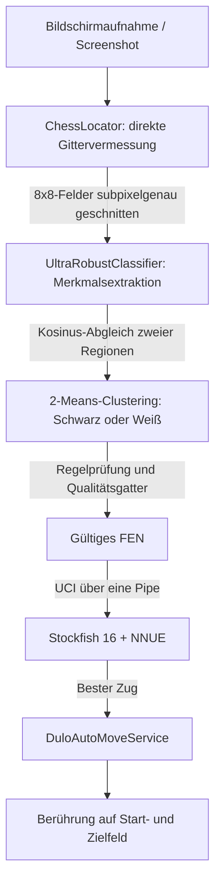

# ♟️ DuLo (Overlay-Schachassistent für Duolingo)

<p align="center">
  <a href="README.md">
    
  </a>
  &nbsp;&nbsp;
  <a href="README_EN.md">
    
  </a>
</p>

<p align="center">
  <a href="https://github.com/styres/forkignore/actions/workflows/build-apk.yml">
    
  </a>
  
  
  
  <a href="LICENSE">
    
  </a>
</p>

<p align="center">
  <strong>DuLo ist ein Android-Assistent, der die Stellung im Schachmodus von Duolingo direkt auf dem Bildschirm auswertet.</strong><br>
  Er verbindet eine genaue Vermessung des Bretts per Bildverarbeitung, die eingebettete Stockfish-16-Engine mit NNUE-Netz und einen Bedienungshilfen-Dienst, der den besten Zug selbst auf das Brett tippt.
</p>

---

## 🌟 Kernfunktionen

- ⚡ **Direkte Vermessung des Gitters in Millisekunden (`ChessLocator`)**
  - Eigene Peaksuche über die Periodizität der Gradienten samt Ausgleichsrechnung: keine Abhängigkeit von einer festen Auflösung oder einem bestimmten Layout;
  - Gleicht Display-Aussparungen, Gestenleisten und verschobene Statusleisten selbstständig aus und trifft das 8×8-Gitter unterhalb eines Pixels genau.
- 🎯 **Sehr robuste Figurenerkennung über zwei Regionen (`UltraRobustClassifier`)**
  - Kosinus-Ähnlichkeit von Kopf- und Körperregion zusammen mit Kantengradienten trennt selbst Bauer, Springer und Dame verlässlich;
  - Adaptives 2-Means-Clustering der Helligkeit bestimmt die Farbe unabhängig von hervorgehobenen Feldern und Farbverläufen;
  - Ein **semantisches Qualitätsgatter** (beide Könige genau einmal, kein Bauer auf Reihe 1/8, Abwertung überzähliger Figuren, Prüfung des FEN) verhindert erfundene Stellungen.
- 🧠 **Stockfish 16 mit NNUE direkt auf dem Gerät**
  - Native C++-Builds für `arm64-v8a`, `armeabi-v7a` und `x86_64`;
  - Das Netz `nn-5af11540bbfe.nnue` liegt im APK, die Kommunikation läuft über das UCI-Protokoll;
  - Liefert Bewertung (Centipawns / Matt), besten Zug und die zweitbeste Antwort.
- 🎨 **Blase am Bildschirmrand, Menü und transparentes Overlay**
  - Der Vordergrunddienst `FloatingBubbleService` zeigt DuLo als frei verschiebbare Blase mit abgerundeten Ecken;
  - ein Tippen öffnet ein kleines Menü mit dem Schalter **Auto** im Stil der Systemkacheln
    (**Off** / **On**, animiert) und dem Knopf **Beenden**;
  - auf das Brett zeichnet DuLo nichts: `TransparentCanvasOverlay` zeigt nur eine ruhige Kachel in
    der Bildschirmmitte, wenn etwas schiefgeht, und reicht Berührungen durch;
  - geht etwas schief, steht dort schlicht **Something went wrong :(** statt einer technischen Fehlertafel.
- 🔁 **Dauerbeobachtung: die Stellung wird fortgeschrieben, nicht neu erraten**
  - Der Kern: Ein Zug verändert genau zwei Felder. Welche das sind, verraten schon die billigen
    Feldabtastungen - Startfeld leer, Zielfeld besetzt. Welche Figur dort stand, steht bereits in
    der gemerkten Stellung. Damit ist der Zug vollständig bekannt, **ohne Bildschirmfoto,
    Brettvermessung und Musterabgleich**;
  - das ist nicht nur schneller, es beseitigt die eigentliche Fehlerquelle: Wird die Stellung bei
    jedem Zug neu aus dem Bild abgeleitet, sammeln sich Fehleinordnungen an, bis nichts mehr
    zusammenpasst. Fortgeschrieben bleibt sie so lange richtig, wie die Züge stimmen;
  - **die Zugmarkierung der Oberfläche wird mitgedacht**: Duolingo färbt Start- und Zielfeld des
    letzten Zuges ein und nimmt die vorherige Einfärbung wieder weg. Bei jedem Zug ändern dadurch
    vier Felder ihr Aussehen, obwohl nur zwei zum Zug gehören. Leere Felder, die nur ihre Farbe
    wechseln, zählen deshalb nicht mehr als Veränderung - entscheidend ist die Streuung, denn eine
    Farbfläche bringt keine Kanten mit, eine Figur schon;
  - bleiben mehrere Zielfelder möglich, entscheidet die **Gangart der ziehenden Figur**: erreichbar
    ist immer nur eines davon;
  - passt der Zug nicht in dieses Muster (Rochade, en passant, unklare Aufnahme), übernimmt die
    vollständige Erkennung als Rückfallebene;
  - die **Blase wird vom Brett ferngehalten**: liegt sie darüber, verdeckt sie Felder in der
    Aufnahme und fängt die Berührungen des Auto-Zugs ab, weil sie dort das oberste Fenster ist.
    Nach jeder Vermessung wird sie bei Überlappung an den nächsten freien Rand geschoben - das ist
    verlässlicher, als zu messen, ob sich das Gerät an `FLAG_SECURE` hält;
  - die vollständige Erkennung hat eine **Bremse**: nach einem ergebnislosen Durchgang bringt ein
    sofort folgender zweiter fast nie etwas Neues, liefe aber mehrmals je Sekunde;
  - das zuletzt gelieferte Bildschirmbild wird **bereitgehalten statt verworfen**: MediaProjection
    liefert nur bei Veränderungen ein neues, und bei stillstehendem Brett stand sonst überhaupt
    kein Bild zur Verfügung - ausgerechnet dann, wenn die vollständige Erkennung zum Aufräumen
    gebraucht wurde;
  - **Rochaderechte werden mitgeführt**: aus der Figurenstellung sind sie nicht ablesbar, denn ein
    König, der nach f1 und zurück gegangen ist, steht wieder zu Hause und darf trotzdem nie wieder
    rochieren. Geraten würde das Recht zurückgegeben und die Engine schlüge eine Rochade vor, die
    das Spiel ablehnt;
  - eine **Drehung des Bildschirms** setzt die Aufnahmefläche neu auf: VirtualDisplay und
    ImageReader haben eine feste Größe, nach einer Drehung kämen sonst weiterhin Bilder im alten
    Format und jede Feldabtastung ginge daneben;
  - alle sechs Halbzüge wird die fortgeschriebene Stellung **gegen den Bildschirm geprüft**. Das
    Fortschreiben hat keine Rückkopplung: Wird ein Zug einmal falsch abgelesen, rechnet die Engine
    ab da auf einer Stellung, die es gar nicht gibt - ihre Vorschläge sind dann auf dem echten
    Brett Unsinn und verschenken Figuren, ohne dass etwas nach einem Fehler aussieht. Der Abgleich
    bringt zugleich den Brettausschnitt auf den neuesten Stand, an dem die Berührungen hängen;
  - ein **unverändertes Brett gilt nicht als Stillstand** - aber nur, solange der Gegner am Zug
    ist. Sind wir am Zug und es tut sich nichts, ist das genau der Fall, für den es die Aufsichtsuhr
    gibt: etwa weil eine Berührung dauerhaft danebengeht. Ohne diese Unterscheidung galt auch das
    als Fortschritt, und DuLo wartete auf einen Zug, der nie kommt;
  - über der Beobachtungsschleife wacht eine **Aufsicht**: Die Schleife meldet bei jedem Takt einen
    Herzschlag; bleibt er aus, obwohl gerade nicht gerechnet wird, oder ist ihr Auftrag beendet,
    wird sie neu angeworfen. Der Herzschlag zählt bewusst nur außerhalb einer laufenden Berechnung -
    ein Takt, in dem gerechnet wird, dauert länger als die Bedenkzeit und ist nicht tot, sondern
    beschäftigt. Wer das verwechselt, bricht die Berechnung mitten im Zug ab.
    Der erste Zug nach dem Einschalten stammt nämlich nicht aus der Schleife, sondern unmittelbar
    aus dem Einschalten - hörte sie auf, kam genau ein Zug und danach keiner mehr, bis der Nutzer
    von Hand aus- und wieder einschaltete. Die Aufsicht übernimmt jetzt genau das;
  - ein einzelner Aussetzer der Aufnahme schaltet nichts mehr ab: Die Aufnahmefläche ist kurz nicht
    vorhanden, während sie neu angelegt wird. Erst nach fünf Fehlversuchen in Folge gilt die
    Freigabe als verloren;
  - über allem wacht eine **Aufsichtsuhr**: geschieht zwölf Sekunden lang gar nichts mehr, wird die
    Buchführung verworfen und die Stellung frisch vom Bildschirm gelesen. Jede Sackgasse ist damit
    höchstens ein Aussetzer von wenigen Sekunden.
  - Beim Einschalten legt DuLo die Seiten fest: was unten auf den beiden Reihen steht, sind die eigenen
    Figuren, oben steht der Gegner. Ob die eigenen hell oder dunkel sind, entscheidet die
    Helligkeitsclusterung - daraus ergibt sich die eigene Farbe. Sie wird bei jeder neuen Grundstellung neu bestimmt, denn man spielt mal Weiß, mal Schwarz.
  - Danach zeigt DuLo den besten Zug für die eigene Farbe und wartet;
  - **wer gezogen hat, entscheidet der Brettvergleich**: die beiden zuletzt angenommenen Stellungen
    werden Feld für Feld verglichen. Die Figur, die auf einem Feld neu auftaucht, benennt den
    Ziehenden - das trägt auch beim Schlagzug, bei dem eine Figur der Gegenfarbe verschwindet;
  - **der Zug gilt als ausgeführt, sobald er auf dem Brett steht**: dafür genügt es, seine beiden
    Felder nachzusehen - Startfeld leer, Zielfeld besetzt;
  - spielt man etwas anderes, fällt das nach ein paar Sekunden auf und es wird neu erkannt;
  - verglichen wird nur **leer / hell / dunkel**, nicht die Figurenart: welche Figur auf einem Feld
    steht, verwechselt der Musterabgleich gelegentlich, und eine einzelne Verwechslung auf einem
    unberührten Feld hätte sonst als Veränderung gezählt;
  - ist der Vergleich **nicht eindeutig** (Animation, mehr als vier veränderte Felder,
    widersprüchliche Farben), wird nichts entschieden und die Vergleichsbasis bleibt stehen. Genau
    das ist wichtig: ein stillschweigendes Übergehen würde den Zug des Gegners verschlucken;
  - bleibt der Vergleich mehrfach hintereinander unklar, greift eine **Notbremse**: die aktuelle
    Stellung wird als neue Grundlage angenommen und gerechnet. So kann die Anzeige nicht dauerhaft
    stehenbleiben;
  - dafür verfolgt DuLo **fünfmal pro Sekunde jede Figurenposition**: je Feld werden Streuung (steht
    dort eine Figur?) und Helligkeit (hell oder dunkel?) gelesen, direkt aus dem Frame-Puffer und ohne
    Vollbild-Kopie;
  - **das Overlay bleibt dabei durchgehend stehen**: Blase, Menü und Zeichenebene tragen `FLAG_SECURE`
    und erscheinen gar nicht erst in der Bildschirmaufnahme. Ob das Gerät sich daran hält, misst DuLo
    einmal je Sitzung nach und fällt sonst auf kurzes Ausblenden zurück;
  - die eigene Farbe kommt aus der Grundstellung (unten die eigenen Figuren) und wird bei jeder neuen
    Partie neu bestimmt - mal spielt man Weiß, mal Schwarz;
  - die volle Erkennung läuft an, sobald die Figuren zwei Takte lang stillstehen - spätestens aber nach
    rund drei Sekunden, damit dauerhafte Animationen der Oberfläche sie nicht aufhalten.
- 🤖 **Auto-Zug (Schalter „Auto", standardmäßig aus)**
  - trägt die Dauerbeobachtung selbst: rechnet bei jedem Zug des Gegners und tippt den Zug dann
    auch. Ein zweiter Schalter muss dafür nicht eingeschaltet werden;
  - der Bildschirm bleibt dabei unberührt: der Zug wird ausgeführt, nicht angezeigt;
  - getippt wird erst das Startfeld, dann das Zielfeld, mit 0,35 Sekunden Pause dazwischen. Die
    Pause ist mit Absicht reichlich: Die erste Berührung wählt die Figur aus, und kommt die zweite
    zu früh, wird sie verworfen und der Zug findet nicht statt;
  - bei einer **Umwandlung** blendet Duolingo eine Tafel mit vier Figuren ein (Dame, Turm, Läufer,
    Springer). Wo sie steht, lässt sich nicht ausrechnen: Sie hängt am Umwandlungsfeld, wird aber
    an den Bildschirmrand gerückt, wenn sie sonst hinausragen würde. DuLo **sucht** sie deshalb an
    ihrem unverwechselbaren Muster - vier helle Symbole nebeneinander, jedes rund ein halbes Feld
    breit, im Abstand von je einem Feld - und tippt die Dame an. Wird sie nicht gefunden, wird
    nichts getippt: Blind auf eine vermutete Stelle zu tippen wäre schlimmer als ein unvollendeter
    Zug, denn es könnte einen ganz anderen Zug auslösen;
  - nach der letzten Berührung ist DuLo schon nach 0,1 Sekunden wieder aufnahmebereit. Die
    Vergleichsbasis wird dabei erst genommen, wenn das Brett zwischen zwei Takten stillsteht - die
    Zuganimation muss also nicht pauschal abgewartet werden. Die
    Feldmitten kommen aus dem vermessenen Brettrechteck. Blase und Menü werden für die Dauer der
    Berührungen durchlässig geschaltet, sonst fangen sie den eigenen Zug ab, wenn sie gerade über
    dem Brett liegen;
  - **während getippt wird, ruht die Beobachtung**: Die angetippte Figur wird hervorgehoben, und
    Duolingo blendet Punkte auf den möglichen Zielfeldern ein - für die Feldabtastung sehen diese
    Punkte aus wie Figuren. Ein in diesem Moment abgelesener Zug wäre erfunden und würde die
    gemerkte Stellung verderben;
  - wird ein vorgeschlagener Zug nicht ausgeführt, wird **gestuft** vorgegangen. Steht das Brett
    unverändert, gibt es dafür drei Erklärungen, und sie brauchen verschiedene Antworten: Man war
    nicht am Zug (warten ist richtig), die Berührung ging daneben (ein zweiter Versuch hilft), oder
    die gemerkte Stellung ist veraltet - etwa weil ein Schlagzug des Gegners übersehen wurde. Dann
    steht dort eine Figur, die es nicht mehr gibt, der getippte Zug ist unmöglich, und **beide
    Seiten warten aufeinander**. Deshalb: erst ein zweiter Tippversuch, dann ein Abgleich mit dem
    Bildschirm - und nie mehr pauschales Warten;
  - ergibt die fortgeschriebene Stellung etwas Unmögliches, wird sie verworfen und frisch vom
    Bildschirm gelesen.
  - Dafür ist ein **Bedienungshilfen-Dienst** nötig: Unter Android darf eine App Berührungen nur
    über `AccessibilityService.dispatchGesture` an eine andere App schicken. DuLo muss deshalb
    einmalig unter **Einstellungen › Bedienungshilfen** freigegeben werden; ohne Freigabe springt
    der Schalter zurück und die Einstellungen werden geöffnet.
  - Der Dienst wertet keine Ereignisse aus und liest keine Bildschirminhalte; er schickt
    ausschließlich die beiden Tippgesten.
- 🔒 **Vollständig offline**
  - Bildverarbeitung und Engine laufen ausschließlich auf dem Gerät, es gibt keine Netzwerkanfragen und keine Datenübertragung.

---

## 📐 Aufbau und Datenfluss



---

## ♟️ Konfiguration der Engine

Die Engine wird beim Handshake auf maximale Spielstärke bei höchstens 2 Sekunden Bedenkzeit pro Zug
eingestellt (siehe `StockfishBridge`). Gesetzt wird nur, was die Engine im Handshake als
unterstützte Option meldet; alles andere wird übersprungen und in der Diagnose vermerkt.

| Option              | Wert                                                                            |
|---------------------|---------------------------------------------------------------------------------|
| Threads             | logische Kerne minus 1 (z. B. 15 bei 16 Kernen), mindestens 1                    |
| Hash                | 256 MB bei 4-6, 512 MB bei 8-12, 1024 MB ab 16 logischen Kernen                   |
| MultiPV             | 1                                                                                |
| Ponder              | false                                                                            |
| Skill Level         | 20                                                                               |
| UCI_LimitStrength   | false                                                                            |
| Move Overhead       | 10 ms (die Engine läuft lokal auf dem Gerät)                                      |
| nodestime           | 0                                                                                |
| UCI_ShowWDL         | true                                                                             |
| NumaPolicy          | auto                                                                             |
| SyzygyPath          | nur gesetzt, wenn unter `filesDir/syzygy` Tablebases liegen                       |
| SyzygyProbeDepth    | 1 (nur mit Tablebases)                                                            |
| SyzygyProbeLimit    | 5 (nur mit Tablebases)                                                            |
| Syzygy50MoveRule    | true (nur mit Tablebases)                                                         |
| Suchbefehl          | `go depth 30 movetime 2000` mit vorzeitigem Abbruch; `ucinewgame` nur bei einer neuen Partie |

Weitere Punkte der Vorgabe:

- **Bedenkzeit ist eine Obergrenze, kein Soll** - aber der Abbruch ist bewusst streng: Er greift
  erst, wenn Tiefe 20 erreicht ist, derselbe Zug über sechs Suchtiefen steht **und** mindestens die
  halbe Bedenkzeit verbraucht ist. Fehlt eines davon, wird bis zum Schluss gerechnet. Ein
  gefundenes Matt beendet die Suche ohne Zeitschranke. Zwischenstände einer fehlgeschlagenen
  Fenstersuche (`lowerbound`/`upperbound`) zählen nicht mit - ihre Hauptvariante kann in die Irre
  führen. Spielstärke geht hier vor einer gesparten Sekunde.
- **Transpositionstabelle**: `ucinewgame` leert sie und wird deshalb nur gesendet, wenn die neue
  Stellung keine Fortsetzung der vorherigen ist - erkennbar daran, dass Figuren hinzugekommen sind
  (innerhalb einer Partie verschwinden sie nur) oder die Grundstellung auf dem Brett steht. Die
  frühere Regel "28 Figuren oder mehr" traf in der ganzen Eröffnung zu und warf die Tabelle bei
  jedem Zug weg - ausgerechnet in der Phase, in der sie am meisten trägt.
- **Passende Binary**: Liegen im APK neben `libstockfish.so` weitere Varianten
  (`libstockfish-vnni512.so`, `-bmi2`, `-avx2`, `-armv8-i8mm`, `-armv8-dotprod`), wählt die App
  anhand der Merkmale aus `/proc/cpuinfo` die stärkste passende aus. Aktuell liefert das Projekt
  nur die generische Variante je ABI mit; wer die Binaries selbst baut, kann die Varianten einfach
  unter diesen Namen dazulegen.
- **Hash-Nachregelung**: Meldet die Engine über mehrere Suchen im Mittel mehr als 30 Prozent
  `hashfull`, verdoppelt die App den Hash (höchstens auf das Vierfache des Ausgangswerts).
- **Transpositionstabelle bleibt warm**: `ucinewgame` läuft nur beim Beginn einer neuen Partie
  (ab 28 Figuren auf dem Brett). Innerhalb einer Partie ist die nächste Stellung die Fortsetzung der
  vorherigen; die gespeicherten Bewertungen passen weiter und ersparen der Suche viel Arbeit. Sie bei
  jedem Zug wegzuwerfen kostet spürbar Spielstärke.
- **Speichergrenze des Geräts**: Der Tabellenwert wird auf ein Viertel des physischen
  Arbeitsspeichers gedeckelt. Ohne diese Grenze beendet Android den Engine-Prozess auf Telefonen
  mit wenig Speicher, was mehr Spielstärke kostet als der kleinere Hash.
- **Große Speicherseiten**: Die Einstellung "Sperren von Seiten im Speicher" gibt es nur unter
  Windows und betrifft diese App nicht. Wer dieselbe Konfiguration auf einem Windows-Rechner fährt,
  sollte das Recht dort für den Benutzer vergeben, damit Stockfish Large Pages nutzen kann.

Ein Hinweis zur Reproduzierbarkeit: Mit mehreren Threads ist die Suche unter `movetime` nicht mehr
deterministisch, zwei Analysen derselben Stellung können also unterschiedliche Züge liefern. Die App
puffert die Ergebnisse je FEN, ein zweiter Klick auf ein unverändertes Brett zeigt deshalb dieselbe
Empfehlung.

---

## 📂 Aufbau des Projekts

```text
├── dulo/         # Android-Anwendung (Hauptprojekt)
│   ├── app/src/main/java/   # Quelltext (Locator, Classifier, Dienst, Oberfläche)
│   ├── app/src/main/jniLibs/# Vorkompilierte native Stockfish-Bibliotheken (.so)
│   ├── app/src/main/assets/ # Vorlagenbilder und NNUE-Gewichte
│   └── app/src/test/        # Kotlin-Unit-Tests für Algorithmen und Protokoll
├── test_images/             # Testbilder
│   ├── benchmarks/          # Positive Referenzfälle (duolingo_1~3, duolingo_test_*)
│   ├── bugs/                # Fälle aus gemeldeten Fehlern und Negativbeispiele
│   └── calibration/         # Aufnahmen zur Vermessung des Gitterversatzes
├── tools/                   # Werkzeuge: Vorlagen erzeugen, ONNX exportieren, Kalibrierung
├── docs/                    # Entwürfe und Entwicklungsnotizen
└── archive/                 # Ältere Prototypen und Diagnoseskripte
```

---

## 🚀 Erste Schritte

### Weg 1: fertiges APK herunterladen

1. Die **[Actions-Seite des Repositories](https://github.com/styres/forkignore/actions)** öffnen;
2. den letzten erfolgreichen Lauf von **`Build DuLo APK`** anklicken;
3. unten unter **Artifacts** das Archiv `DuLo-APK` herunterladen, entpacken und auf
   einem Android-Gerät (ab Android 8.0) installieren.

### Weg 2: aus den Quellen bauen

Voraussetzungen:
- **JDK 17 oder neuer**
- **Android SDK** (API-Level 34, Min-SDK 26)
- **Git LFS** (sonst wird nur der Zeiger statt der NNUE-Datei geladen)

```bash
# 1. Repository klonen (mit LFS)
git clone https://github.com/styres/forkignore.git
cd forkignore
git lfs pull

# 2. In das Android-Projekt wechseln und bauen
cd dulo
./gradlew assembleDebug

# 3. Das fertige APK liegt unter: app/build/outputs/apk/debug/app-debug.apk
```

---

## 📱 Bedienung

1. **Berechtigungen erteilen**: Beim ersten Start die **Overlay-Berechtigung**
   (`SYSTEM_ALERT_WINDOW`) und die **Bildschirmaufnahme** (`MediaProjection`) freigeben.
2. **DuLo starten**: Der Umschalter auf dem Startbildschirm ist das Foto von DuLo. Ein Tippen startet
   den Dienst, das Bild leuchtet dann mit grünem Rahmen; ein weiteres Tippen beendet ihn wieder.
3. **Duolingo öffnen** und ein Schachlevel starten.
4. **Menü öffnen**: Kurz auf die Blase tippen. Es erscheinen:
   - der Schalter **Auto** (steht auf **Off**): ein Tippen schiebt den Knopf animiert nach rechts, die
     Spur wird grün und die Beschriftung wechselt auf **On**. Ab dann rechnet DuLo bei jedem Zug des
     Gegners und tippt den besten Zug selbst auf das Brett. Zurück auf **Off** beendet alles.
   - **Beenden**: schließt das Menü und stoppt DuLo samt Bildschirmaufnahme vollständig, so als hätte
     man die App über die Systemeinstellungen beendet.
5. **Bedienungshilfen freigeben**: Beim ersten Einschalten von **Auto** springt der Schalter zurück
   und die Systemeinstellungen öffnen sich. Dort **Bedienungshilfen › DuLo** aktivieren - ohne diese
   Freigabe darf keine App Berührungen an eine andere App schicken.
6. **Farbe umschalten**: Spielt DuLo einmal für die falsche Seite, schaltet ein langer Druck auf die
   Blase die eigene Farbe um. Die fortgeschriebene Stellung wird dabei verworfen und neu erkannt,
   denn mit der Blickrichtung dreht sich die Zuordnung der Felder.

DuLo schreibt keine Screenshots auf die Platte und legt nichts in der Zwischenablage ab; alles bleibt
im Arbeitsspeicher des Geräts.

---

## 🤝 Mitwirken

Issues und Pull Requests sind willkommen. Die Konventionen stehen in [CONTRIBUTING.md](CONTRIBUTING.md).

---

## ⚖️ Haftungsausschluss

1. Dieses Projekt dient dem Lernen und dem fachlichen Austausch über **Bildverarbeitung, lokale
   Inferenz auf Mobilgeräten und Mensch-Maschine-Interaktion**.
2. Es darf nicht in Ranglistenpartien oder auf eine Weise eingesetzt werden, die den
   Nutzungsbedingungen von Duolingo widerspricht. Für Folgen unsachgemäßer Nutzung übernehmen die
   Entwickler keine Verantwortung.
3. Marke und Oberfläche von Duolingo gehören Duolingo, Inc.; die Schach-Engine Stockfish steht unter
   der GPLv3.

---

## 📄 Lizenz

Dieses Projekt steht unter der [MIT-Lizenz](LICENSE).
